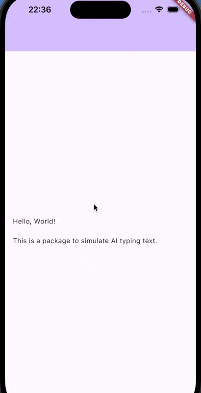

# ai_typing

This Flutter package simulates AI typing effects for your Text widgets. With simple integration, you can enhance the user experience by adding dynamic typing animations to your app.



## Installation

Add the package to your pubspec.yaml:

```yaml
dependencies:
  ai_typing: ^0.0.1
```

Then run flutter pub get to install the package.

## Usage

```dart
AiTypingText(
    Text(
        'Hello, World!\n\nThis is a package to simulate AI typing text.'
    ),
);
```

## Features

- Simulate AI typing animations.
- Easy to integrate with any Text widget.
- Customizable typing speed and delay.

## License

This project is licensed under the MIT License - see the [LICENSE](./LICENSE) file for details.
